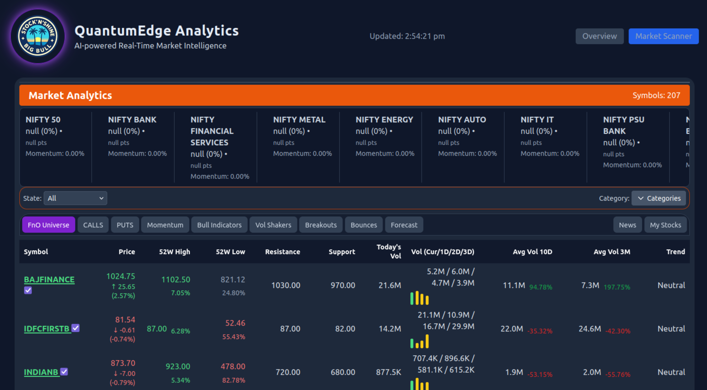
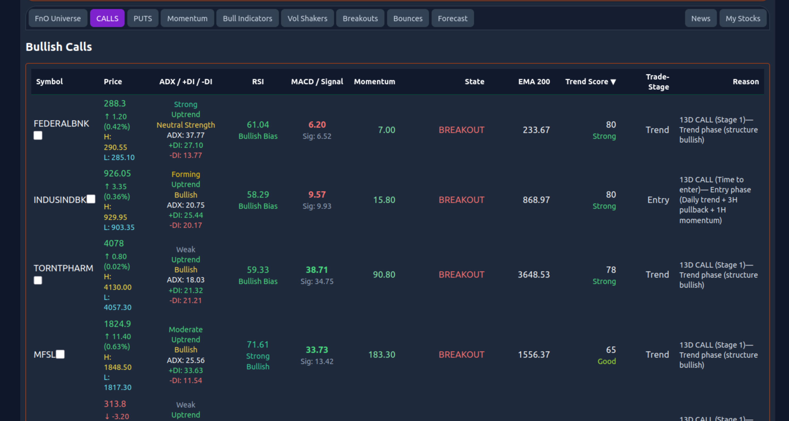
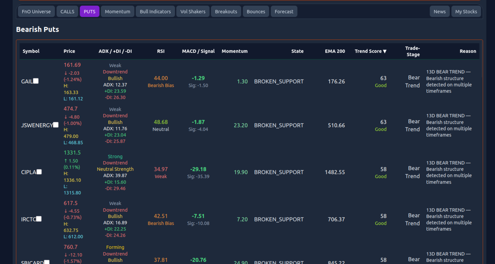
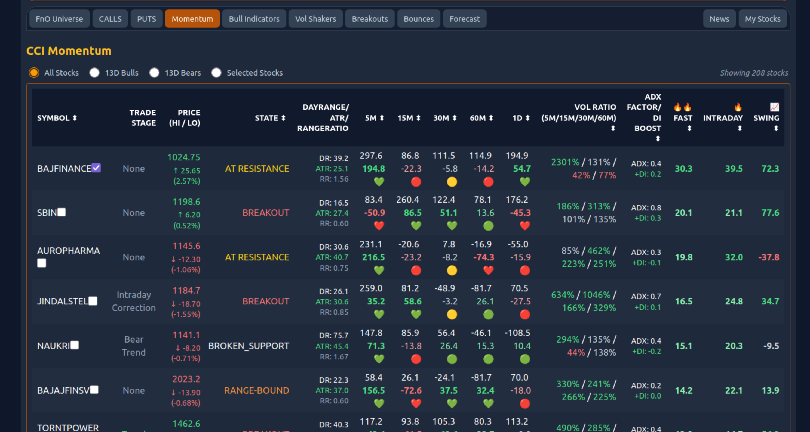
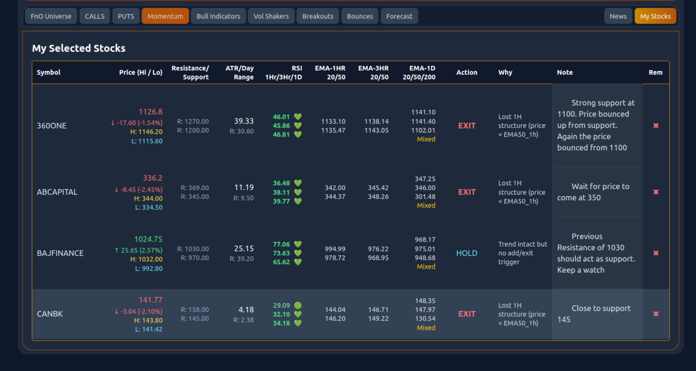

📊 Stock Market Intelligence Engine

### Systematic Multi-Stage Momentum Classification Framework

  

A structured, multi-stage stock filtering and momentum analysis engine designed to identify high-probability trading opportunities in the Indian markets.

🚀 Overview

- The Stock Market Intelligence Engine is built to:
- Filter the full FnO universe systematically
- Identify momentum shifts using CCI and multi-timeframe signals
- Classify stocks into structured stages
- Provide actionable dashboards for trading decisions

This project focuses on clarity, signal quality, and systematic selection rather than noise-based trading.

🧠 Core Architecture

🔹 Stage 1 – Momentum Qualification

 - Daily CCI filtering
 - Delta-based momentum confirmation
 - Volume ratio validation
 - RSI and EMA structural alignment

  ## 🖥 Dashboard Preview

    ### 🔹 FnO Universe

🔹 Stage 2 – Structural Classification

   Based on Bull/Bear Strategy on 1hr/3hr/1D TF, Stocks are grouped into:

   - CALLS
   - PUTS

### 🔹 CALLS (Bulls)

### 🔹 PUTS

🔹 Stage 3 – Intraday Momentum

   - 5m/15m/15m/60m CCI tracking
   - CCI delta acceleration
   - Volume spike validation
   - EMA 20 / EMA 50 tracking
   - RSI positioning

### 🔹 CCI Momentum

📈 Indicators Used

  - Commodity Channel Index (CCI)
  - RSI
  - EMA 20 / EMA 50 / EMA 200
  - Volume Ratio
  - Multi-timeframe momentum delta

🔹 Selected Stocks

  - All details for the stocks selected

### 🔹 My Stocks

🏗 Tech Stack

  - HTML / Tailwind (Dashboard UI)
  - JavaScript (Frontend logic)
  - Node.js (if applicable)
  - Custom filtering engine logic

🎯 Design Philosophy

This engine is built on three principles:

  - Eliminate randomness.
  - Filter before acting.
  - Let structure define opportunity.  

📌 Roadmap

  - Stage 3 refinement logic
  - Backtesting integration
  - Alert engine
  - Performance metrics dashboard
  - Risk management layer

⚠️ Disclaimer

This project is for educational and research purposes only.
Not financial advice.

👤 Author

  - Raman Gupta